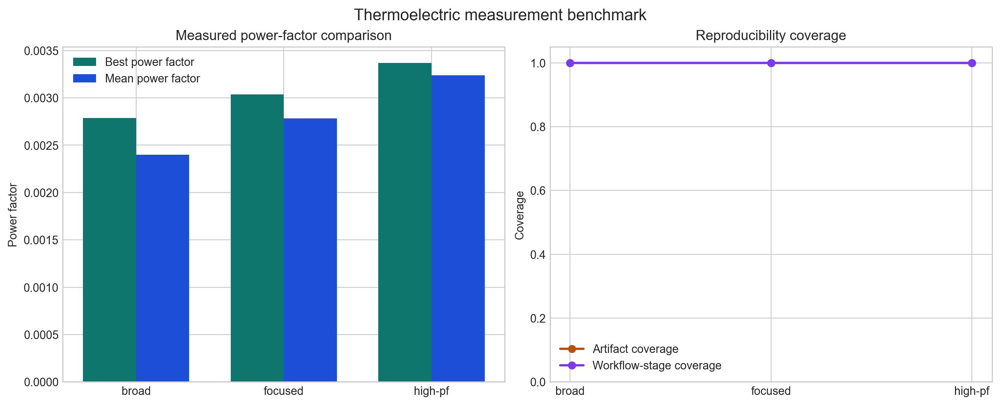
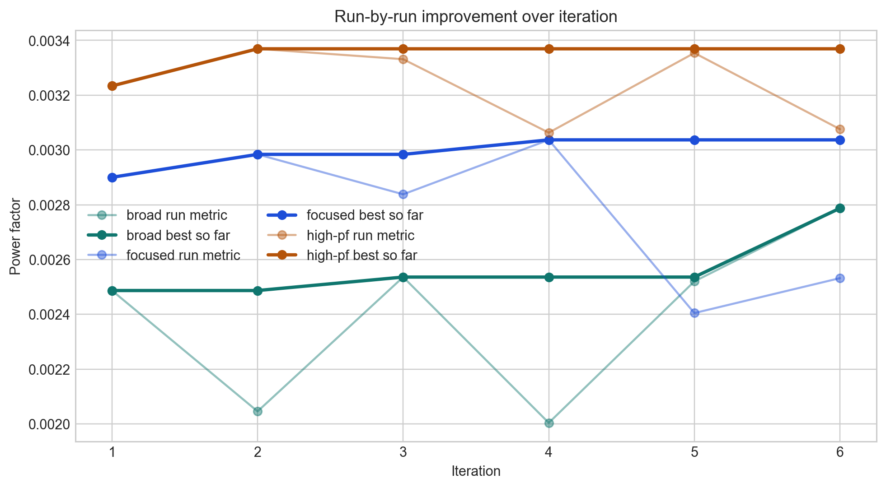

# physics_researcher

`physics_researcher` is a production-minded Python monorepo for an autonomous digital materials lab. It combines typed orchestration services, agent tooling, real simulator adapters, experiment tracking, and local infrastructure so closed-loop materials or process optimization workflows can be developed, tested, and run from one repository.

## Status

- Working local development scaffold
- Real workflow-backed adapters for LAMMPS and MEEP, with Quantum ESPRESSO, OpenMM, Elmer, and DEVSIM scaffolded on the same contract
- FastAPI API, Typer CLI, Redis/Ray worker path, PostgreSQL storage, MLflow hooks, and OpenTelemetry wiring in place

## Architecture at a glance

- `apps/api`: FastAPI control plane for campaigns, runs, artifacts, and health checks
- `apps/worker`: Redis Streams consumer that dispatches campaign steps via Ray
- `packages/core`: Pydantic v2 models, enums, settings, and utility helpers
- `packages/campaigns`: orchestration services, queueing, and MLflow logging
- `packages/simulators`: simulator contract, workflow-backed adapters, templates, parsers, and execution infrastructure
- `skills`: thin simulator-specific Codex skills for LAMMPS, MEEP, Quantum ESPRESSO, OpenMM, Elmer, and DEVSIM
- `packages/optimizers`: Bayesian optimization and batch-selection logic
- `packages/skills`: typed reusable skills that can be exposed as ADK tools
- `packages/agents`: planner, execution, analysis, critic, workflow agent scaffolds, and arXiv literature research orchestration
- `packages/storage`: SQLAlchemy models, repositories, artifact store, and Alembic setup
- `packages/telemetry`: structured logging and tracing helpers
- `examples`: seeded demo campaign, config samples, and notebook scaffold
- `examples/prompts`: runnable problem statements and iteration prompts
- `docs`: ADRs, architecture notes, and operator playbooks

More detail is in [docs/architecture/overview.md](docs/architecture/overview.md) and [docs/adr/0001-orchestration-and-simulator-boundary.md](docs/adr/0001-orchestration-and-simulator-boundary.md).
The stage-based workflow extension is summarized in [docs/architecture/simulator-workflows.md](docs/architecture/simulator-workflows.md).
The literature analysis path is summarized in [docs/architecture/literature-research.md](docs/architecture/literature-research.md).
The planned product surface for a materials workbench is outlined in [docs/architecture/materials-workbench-ui.md](docs/architecture/materials-workbench-ui.md).
The current product positioning is described in [docs/playbooks/materials-positioning.md](docs/playbooks/materials-positioning.md).
The next skill and simulator milestones are tracked in [docs/playbooks/materials-skill-and-simulator-roadmap.md](docs/playbooks/materials-skill-and-simulator-roadmap.md).
The photonics upgrade path toward adjoint-driven experiments is tracked in [docs/playbooks/photonics-adjoint-roadmap.md](docs/playbooks/photonics-adjoint-roadmap.md).

## Core capabilities

- Create and manage optimization campaigns
- Define objectives, constraints, search spaces, and budgets
- Step campaigns synchronously for debugging or asynchronously through Redis and Ray
- Persist campaign metadata, runs, metrics, decisions, summaries, and artifacts
- Track runs in MLflow
- Expose deterministic skills and ADK-compatible agent tools
- Execute typed single-stage or multi-stage simulator workflows with per-stage manifests, logs, and parse summaries
- Preserve stage-level provenance and cross-simulator transfer metadata
- Validate the full loop and artifact/provenance model through real-adapter execution paths

## Agentic Research Loop

The intended operating mode is closer to an autoresearcher than a single script:

1. An agent proposes a candidate, experiment, or workflow choice.
2. Typed skills convert that intent into a campaign or stage spec.
3. Simulator adapters write controlled artifacts and launch real engines.
4. Parsers and validators turn raw outputs into reusable metrics and provenance.
5. The agent critiques results, updates the next hypothesis, and steps again.

From the CLI, that loop looks like:

```bash
uv run autolab create-campaign examples/campaigns/qe_to_meep_photonic_screen.json
uv run autolab start-campaign <campaign-id>
uv run autolab step-campaign <campaign-id> --execute-inline
uv run autolab list-runs <campaign-id>
uv run autolab inspect-run <run-id>
uv run autolab research-literature "Quantum sensor stability" --paper 2401.12345 --paper https://arxiv.org/abs/2402.54321
```

The key boundary is that the agent decides what to try, while adapters own how files, commands, logs, parsing, and validation are handled.

## Quickstart

### Prerequisites

- Python `3.12`
- `uv`
- Docker with Docker Compose
- Node.js `>=20` for Prettier-based formatting

### Bootstrap

```bash
uv run autolab init
uv sync --all-packages
npm ci
make up
```

The API will be available at [`http://localhost:8000/docs`](http://localhost:8000/docs).

### Run the demo workflow

```bash
uv run autolab seed-demo
uv run autolab start-campaign <campaign-id>
uv run autolab step-campaign <campaign-id> --execute-inline
uv run autolab list-runs <campaign-id>
```

The seeded example campaign lives at [demo_campaign.json](examples/campaigns/demo_campaign.json).

## Development commands

```bash
make sync
make lint
make format
make typecheck
make test
uv run autolab --help
npm run format:check
```

## Example problems to try

Start with the prompt and spec library in [examples/prompts/experiment_prompts.md](examples/prompts/experiment_prompts.md).

Research and optimization problems that fit the current architecture well:

- Electronic-structure to photonics transfer, where Quantum ESPRESSO informs a downstream MEEP device screen
- Electronic-structure to atomistic bootstrapping, where Quantum ESPRESSO informs a downstream LAMMPS study
- Atomistic to continuum multiscale screening, where LAMMPS feeds effective parameters into Elmer
- Electro-optic device co-design, where DEVSIM outputs inform a downstream MEEP stage
- Molecular relaxation and binder-state triage, where OpenMM is used as a fast structural filter before heavier downstream work
- Standalone photonic inverse screening, where MEEP sweeps geometry and refractive-index choices directly
- Standalone process-window studies in LAMMPS, where thermostat, timestep, and structure choices are iterated under strict artifact capture

Good examples of what this stack is not ready for yet:

- full protein discovery with docking, folding, and wet-lab planning
- aerodynamic drag optimization without a CFD adapter
- arbitrary cross-simulator mappings that are not registered in the workflow layer

The most useful first runs are:

- [demo_campaign.json](examples/campaigns/demo_campaign.json)
- [openmm_protein_relaxation.json](examples/campaigns/openmm_protein_relaxation.json)
- [thermoelectric_sim_to_measurement_loop.json](examples/campaigns/thermoelectric_sim_to_measurement_loop.json)
- [meep_waveguide_inverse_screen.json](examples/campaigns/meep_waveguide_inverse_screen.json)
- [meep_broadband_mode_converter.json](examples/campaigns/meep_broadband_mode_converter.json)
- [meep_splitter_inverse_screen.json](examples/campaigns/meep_splitter_inverse_screen.json)
- [meep_demux_inverse_screen.json](examples/campaigns/meep_demux_inverse_screen.json)
- [qe_to_meep_photonic_screen.json](examples/campaigns/qe_to_meep_photonic_screen.json)
- [qe_to_lammps_forcefield_bootstrap.json](examples/campaigns/qe_to_lammps_forcefield_bootstrap.json)
- [lammps_to_elmer_multiscale_screen.json](examples/campaigns/lammps_to_elmer_multiscale_screen.json)
- [devsim_to_meep_device_coupling.json](examples/campaigns/devsim_to_meep_device_coupling.json)
- [cross_simulator_transfer_verification.json](examples/campaigns/cross_simulator_transfer_verification.json)

Suggested progression:

1. Start with `demo_campaign.json` to inspect the single-stage LAMMPS artifact lifecycle.
2. Run `openmm_protein_relaxation.json` for a simple agent-driven molecular optimization loop.
3. Run `thermoelectric_sim_to_measurement_loop.json` for a simple protocol-to-measurement feedback loop.
4. Run `meep_waveguide_inverse_screen.json` for standalone photonics screening.
5. Move to `qe_to_meep_photonic_screen.json` or `qe_to_lammps_forcefield_bootstrap.json` for cross-simulator handoff.
6. Use `lammps_to_elmer_multiscale_screen.json` or `devsim_to_meep_device_coupling.json` when you want an explicitly interdisciplinary workflow.
7. Use `cross_simulator_transfer_verification.json` when the question is “did we map and record this correctly?” rather than “did we optimize it?”

## Paper-Ready Benchmark

The most practical first benchmark for a paper is the MEEP inverse-design suite:

- benchmark manifest: [benchmark.json](benchmarks/meep_inverse_design/benchmark.json)
- benchmark note: [meep_inverse_design.md](docs/benchmarks/meep_inverse_design.md)

Run it with:

```bash
uv run autolab run-benchmark --manifest-path benchmarks/meep_inverse_design/benchmark.json --execute-inline
```

This creates campaigns, steps them through the existing API, and writes a report to `artifacts/benchmarks/meep-inverse-design-v1/report.json`.

For a broader photonic device benchmark, the repository also includes a multi-device MEEP suite:

- benchmark manifest: [benchmark.json](benchmarks/meep_photonic_devices/benchmark.json)
- benchmark note: [meep_photonic_devices.md](docs/benchmarks/meep_photonic_devices.md)

Run it with:

```bash
AUTOLAB_ENABLE_MEEP=true uv run autolab run-benchmark --manifest-path benchmarks/meep_photonic_devices/benchmark.json --execute-inline
```

This benchmark evaluates a broadband mode-converter task, a two-port splitter task, and a two-port demultiplexer task under a shared `device_score` metric.

To compare `bayesian_gp` and `random_search` on the refined photonic-device family under matched budgets, the repository now also includes:

- benchmark manifest: [baselines_benchmark.json](benchmarks/meep_photonic_devices/baselines_benchmark.json)

Run it with:

```bash
AUTOLAB_ENABLE_MEEP=true AUTOLAB_MEEP_BIN=/path/to/meep-python uv run autolab run-benchmark --manifest-path benchmarks/meep_photonic_devices/baselines_benchmark.json --execute-inline
```

The current local comparison was run with `AUTOLAB_MEEP_BIN=/Users/sebastianboehler/miniconda3/envs/autolab-meep/bin/python`, which points the MEEP simulator adapter at a Python environment that already contains `pymeep`. The resulting report lives at `artifacts/benchmarks/meep-photonic-devices-baselines-v1/report.json`.

In that local run, the refined baseline suite shows the same optimizer preference as `LJ13`: Bayesian is better than random search on all three device classes.

- mode converter `device_score`: `0.5087` vs `0.4556`
- splitter `device_score`: `2.1909` vs `1.9923`
- demux `device_score`: `5.3592` vs `4.3056`

On the aggregate summary, Bayesian also wins on the cross-task averages:

- Bayesian mean best metric: `2.6863`
- Random mean best metric: `2.2512`
- Bayesian mean median metric: `0.5676`
- Random mean median metric: `0.1602`

This does not make the devices literature-competitive, but it is meaningful evidence that the framework's default optimizer is doing nontrivial work beyond a random baseline in both OpenMM and MEEP.

To push the photonic pipeline further with literature-shaped metrics, the repository also includes an advanced suite with:

- benchmark manifest: [advanced_benchmark.json](benchmarks/meep_photonic_devices/advanced_benchmark.json)
- comparison script: [generate_meep_photonic_advanced_comparison.py](scripts/generate_meep_photonic_advanced_comparison.py)

Run it with:

```bash
AUTOLAB_ENABLE_MEEP=true AUTOLAB_MEEP_BIN=/Users/sebastianboehler/miniconda3/envs/autolab-meep/bin/python uv run autolab run-benchmark --manifest-path benchmarks/meep_photonic_devices/advanced_benchmark.json --execute-inline --max-parallel-campaigns 2
uv run python scripts/generate_meep_photonic_advanced_comparison.py
```

The current advanced local run completed all `54/54` MEEP simulations successfully and wrote its report to `artifacts/benchmarks/meep-photonic-devices-advanced-v1/report.json`. It uses a coarse-to-fine Bayesian optimizer, a third optional scatterer block, and dB-shaped photonic metrics.
That full run only succeeded after hardening the coarse-to-fine bounds logic against collapsed or inverted refined windows, so the advanced result also serves as a stability check for the new optimizer path.

The honest comparison against the earlier refined suite is on derived physical metrics, not the old `device_score`, because the refined report predates the new scoring formulation. The checked-in comparison artifacts are:

- `docs/benchmarks/assets/meep_photonic_advanced_comparison.csv`
- `docs/benchmarks/assets/meep_photonic_advanced_comparison.png`

On those raw metrics, the advanced pipeline improves several photonic quantities:

- mode-converter insertion loss: `7.37 dB` -> `5.44 dB`
- splitter excess loss: `25.80 dB` -> `12.18 dB`
- splitter imbalance: `1.17 dB` -> `0.35 dB`
- demux insertion loss: `22.58 dB` -> `20.31 dB`
- demux bandwidth fraction: `0.00` -> `0.21`

It also regresses on some quantities that matter:

- mode-converter bandwidth fraction: `0.39` -> `0.28`
- demux isolation: `1.08 dB` -> `0.89 dB`

So the current conclusion is narrower than "the advanced pipeline wins." The framework can now run a more realistic coarse-to-fine photonic search and improve several device metrics, but the geometry family and objective design are still limiting the final device quality.

To regenerate the comparison figures between the initial suite and the latest refined rerun:

```bash
uv run python scripts/generate_meep_photonic_benchmark_plots.py
```

For a benchmark you can run more easily on a standard Python host, use the OpenMM Lennard-Jones pair suite:

- benchmark manifest: [benchmark.json](benchmarks/openmm_lj_pair/benchmark.json)
- refined multi-seed manifest: [benchmark.json](benchmarks/openmm_lj_pair_refined_multiseed/benchmark.json)
- benchmark note: [openmm_lj_pair.md](docs/benchmarks/openmm_lj_pair.md)
- harder many-body benchmark: [benchmark.json](benchmarks/openmm_lj13_cluster/benchmark.json)
- refined many-body benchmark: [benchmark.json](benchmarks/openmm_lj13_cluster_refined/benchmark.json)
- many-body benchmark note: [openmm_lj_cluster.md](docs/benchmarks/openmm_lj_cluster.md)
- standalone campaign example: [openmm_lj_pair_equilibrium.json](examples/campaigns/openmm_lj_pair_equilibrium.json)

Run it with:

```bash
AUTOLAB_ENABLE_OPENMM=true uv run autolab run-benchmark --manifest-path benchmarks/openmm_lj_pair/benchmark.json --execute-inline
```

This benchmark compares the observed best run against the known Lennard-Jones optimum and records the gap in `artifacts/benchmarks/openmm-lj-pair-v1/report.json`.

The refined local-search benchmark is the more meaningful stress test for optimizer reliability:

```bash
AUTOLAB_ENABLE_OPENMM=true uv run autolab run-benchmark --manifest-path benchmarks/openmm_lj_pair_refined_multiseed/benchmark.json --execute-inline
```

In the current local result, all 6 seeds completed 128/128 runs, the best observed gap was `2.0980834958272965e-08`, the median best gap across seeds was `1.6999244689674953e-07`, and the worst seed still finished at `1.3918876647922573e-06`. That is strong evidence that the loop can repeatedly recover the known Lennard-Jones equilibrium on this simple analytic benchmark.

This should not be described as "past the known optimum" or as broad materials-science SOTA. Here, "near machine precision" means the numerical error against this benchmark's analytic reference is extremely small, not that arbitrary manufactured objects can be simulated to fabrication-level accuracy.

If you want a research-interesting next benchmark, the repository now also includes an OpenMM `LJ13` cluster problem. That benchmark removes rigid-body redundancy, optimizes `3N-6` coordinates directly, and measures the gap to the accepted many-body cluster minimum. Unlike the pair benchmark, failure there is often an optimizer-quality signal rather than just numerical noise.

The raw global-search `LJ13` benchmark is intentionally hard:

```bash
AUTOLAB_ENABLE_OPENMM=true uv run autolab run-benchmark --manifest-path benchmarks/openmm_lj13_cluster/benchmark.json --execute-inline
```

In the current full local rerun with the current code, all 96/96 runs succeeded and the best observed gap was `1.1845116887343465e-07`, while the mean gap across all runs remained large at `686.0569047524017`. That makes it a useful stress test for many-body global search: the pipeline can hit the accepted minimum, but the raw search still produces many poor trajectories and should be judged by hit rate and best-gap statistics rather than the mean alone.

To compare optimizer baselines under the same raw `LJ13` budget, use the baseline suite:

- benchmark manifest: [benchmark.json](benchmarks/openmm_lj13_baselines/benchmark.json)

Run it with:

```bash
AUTOLAB_ENABLE_OPENMM=true uv run autolab run-benchmark --manifest-path benchmarks/openmm_lj13_baselines/benchmark.json --execute-inline
uv run python scripts/generate_openmm_lj13_baseline_artifacts.py
```

The resulting report groups campaigns by `baseline_name` so Bayesian and random-search runs can be compared directly in one summary. In the current 12-campaign local rerun with 6 seeds per baseline, `bayesian_gp` achieved a mean best gap of `3.973642985026042e-07` versus `7.157611510895853e-07` for `random_search`, and it produced stronger low-gap hit rates at both `<1e-5` and `<1e-6`. Both baselines still reached the same best single-run gap of `1.1845116887343465e-07`, so the current evidence is "Bayesian is better on average under this budget," not "random search cannot get there."

The checked-in `LJ13` comparison artifacts are:

- `docs/benchmarks/assets/openmm_lj13_baseline_comparison.csv`
- `docs/benchmarks/assets/openmm_lj13_baseline_comparison.png`

For a fairer local-reliability benchmark, use the refined `LJ13` variant with compact icosahedral perturbations and deterministic local minimization:

```bash
AUTOLAB_ENABLE_OPENMM=true uv run autolab run-benchmark --manifest-path benchmarks/openmm_lj13_cluster_refined/benchmark.json --execute-inline
```

In the current refined local run, all 128/128 runs succeeded, the best observed gap was `1.1845116887343465e-07`, and the mean gap across runs was `2.261867184216726e-06`. That is strong evidence that the OpenMM path can repeatedly recover the accepted `LJ13` minimum once the benchmark evaluates relaxed basin quality instead of raw random coordinates.

For the new Phase-1 experimental-loop path, the repository now also includes a thermoelectric measurement benchmark:

- benchmark manifest: [benchmark.json](benchmarks/thermoelectric_measurement/benchmark.json)
- benchmark note: [thermoelectric_measurement.md](docs/benchmarks/thermoelectric_measurement.md)
- example workflow: [thermoelectric_sim_to_measurement_loop.json](examples/campaigns/thermoelectric_sim_to_measurement_loop.json)

Run it with:

```bash
uv run autolab run-benchmark --manifest-path benchmarks/thermoelectric_measurement/benchmark.json --execute-inline
uv run python scripts/generate_thermoelectric_benchmark_plots.py
```

In the current local run, all 18/18 runs across the three benchmark tasks succeeded.

| Task    |       Best power factor |       Mean power factor | Artifact coverage | Workflow-stage coverage |
| ------- | ----------------------: | ----------------------: | ----------------: | ----------------------: |
| broad   | `0.0027871945048813184` |  `0.002396537237484774` |             `1.0` |                   `1.0` |
| focused |  `0.003036841520352007` | `0.0027825692303721527` |             `1.0` |                   `1.0` |
| high-pf | `0.0033693258370941503` | `0.0032379005513877295` |             `1.0` |                   `1.0` |

This benchmark should not be described as wet-lab validation. The measurement CSVs are generated deterministically inside the `csv_measurement` stage to exercise the protocol, measurement-ingest, metrics, and provenance path before real lab data is attached.





## Parallel Execution

Independent candidate branches can be executed in parallel inside a single campaign step while preserving stage ordering within each workflow run.

Useful controls:

- `AUTOLAB_MAX_PARALLEL_RUNS`
- `AUTOLAB_MAX_PARALLEL_BENCHMARK_CAMPAIGNS`

Example:

```bash
AUTOLAB_ENABLE_OPENMM=true \
AUTOLAB_MAX_PARALLEL_RUNS=4 \
AUTOLAB_MAX_PARALLEL_BENCHMARK_CAMPAIGNS=2 \
uv run autolab run-benchmark --manifest-path benchmarks/openmm_lj_pair/benchmark.json --execute-inline
```

## Local stack

The default Docker Compose stack includes:

- PostgreSQL
- Redis
- MLflow
- OpenTelemetry Collector
- Ray head node
- API service
- Worker service

Real simulator engines are intentionally not included in the default stack.
When simulator binaries or Python modules are missing, the adapters fail with structured execution records, logs, and manifests rather than silent command errors.
For a simulator-enabled local worker, use the optional LAMMPS profile:

```bash
docker compose --profile lammps build worker-lammps
make test-lammps
```

## Testing strategy

- Unit tests for models, skills, stage mappings, and parser behavior
- Integration tests for API lifecycle and simulator adapter contracts
- End-to-end test for the closed-loop demo campaign
- Strict linting and mypy enforcement in CI

## Open source repo conventions

- Contributor guidance: [CONTRIBUTING.md](CONTRIBUTING.md)
- Code of conduct: [CODE_OF_CONDUCT.md](CODE_OF_CONDUCT.md)
- Security policy: [SECURITY.md](SECURITY.md)
- License: [LICENSE](LICENSE)

## Roadmap notes

The current repository is intentionally strong on boundaries and local operability rather than depth of domain-specific simulation logic. The next logical additions are:

- richer optimizer implementations
- production MLflow backend configuration
- deeper OpenMM, Quantum ESPRESSO, and Elmer execution environments
- dashboard UI beyond the current placeholder
- stronger auth and multi-user controls
- CFD-backed drag optimization workflows once a suitable open-source CFD adapter is added
