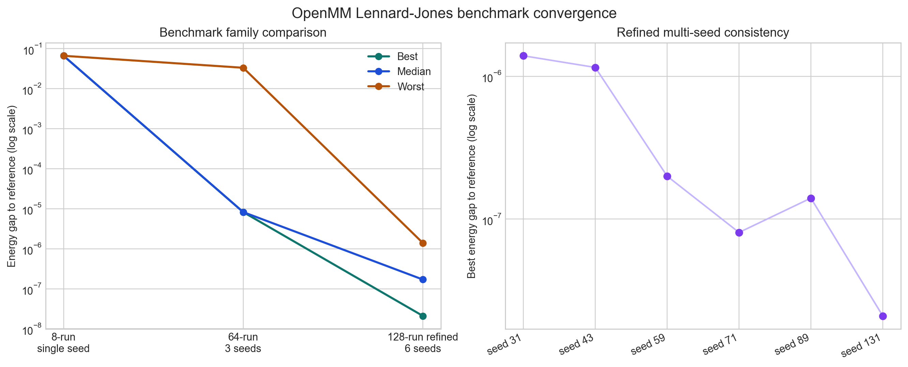

# OpenMM Lennard-Jones Pair Benchmark

This is the easiest real benchmark in the current repository to execute on a standard Python host because it only requires the `openmm` Python package and no external binary.

## Why this benchmark exists

The current OpenMM adapter is not yet a full protein-preparation or protein-ligand pipeline. Using a published protein benchmark here would overclaim what the stack can currently do.

Instead, this benchmark measures something honest and physically grounded:

- the orchestration loop proposes candidate simulation settings
- the OpenMM adapter generates a real Python driver and run artifacts
- OpenMM evaluates a real Lennard-Jones system
- the parser extracts physical metrics
- the benchmark report measures the gap to a known theoretical optimum

## Reference optimum

For a Lennard-Jones pair,

- `V(r) = 4 epsilon [(sigma / r)^12 - (sigma / r)^6]`
- the minimum occurs at `r* = 2^(1/6) sigma`
- the minimum energy is `V(r*) = -epsilon`

This benchmark fixes:

- `sigma = 0.34 nm`
- `epsilon = 0.997 kJ/mol`

So the reference optimum is:

- `reference_distance_nm = 0.38163709642518684`
- `reference_energy_kj_per_mol = -0.997`
- `reference_best_metric = 0.0` for `energy_gap_to_reference`

## What gets optimized

The campaign optimizes:

- `initial_distance`
- near-fixed integrator settings that keep the loop compatible with the general campaign optimizer

The objective is to minimize:

- `energy_gap_to_reference`
- with a secondary objective on `distance_gap_to_reference`

## Run it

Start the API with OpenMM enabled:

```bash
AUTOLAB_ENABLE_OPENMM=true uv run uvicorn autolab.api.main:app --host 127.0.0.1 --port 8000
```

Then run the benchmark:

```bash
uv run autolab run-benchmark benchmarks/openmm_lj_pair/benchmark.json --execute-inline
```

The report is written to:

- `artifacts/benchmarks/openmm-lj-pair-v1/report.json`

For a stronger optimizer-reliability check, run the refined multi-seed variant:

```bash
uv run autolab run-benchmark benchmarks/openmm_lj_pair_refined_multiseed/benchmark.json --execute-inline
```

That report is written to:

- `artifacts/benchmarks/openmm-lj-pair-refined-multiseed-v1/report.json`

The committed comparison figure is:



## How to interpret the result

The key number is:

- `summary.best_observed_gap_to_reference`

Interpretation:

- `0.0` means the loop matched the theoretical optimum exactly within numerical precision
- small positive values mean the loop found a near-optimal candidate
- larger values mean the optimizer did not recover the optimum within the run budget

In the current refined six-seed local run, the best observed gap was `2.0980834958272965e-08` and every seed finished below `1.4e-06`. For this benchmark, that is best understood as near-numerical-saturation of a simple analytic target.

"Near machine precision" here does not mean the repository can simulate arbitrary physical objects as accurately as they can be manufactured. It means the optimizer and simulator together can recover this benchmark's known Lennard-Jones minimum with very small floating-point error. Real materials workflows are limited by model fidelity, force-field quality, discretization, boundary conditions, calibration data, and manufacturing tolerances, which are separate error sources from numerical precision.

This makes the benchmark useful for:

- optimization quality
- adapter correctness
- parser correctness
- reproducibility of generated artifacts
- regression testing after orchestration changes
